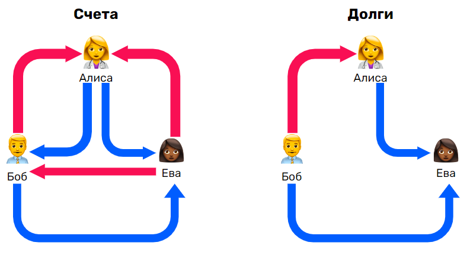
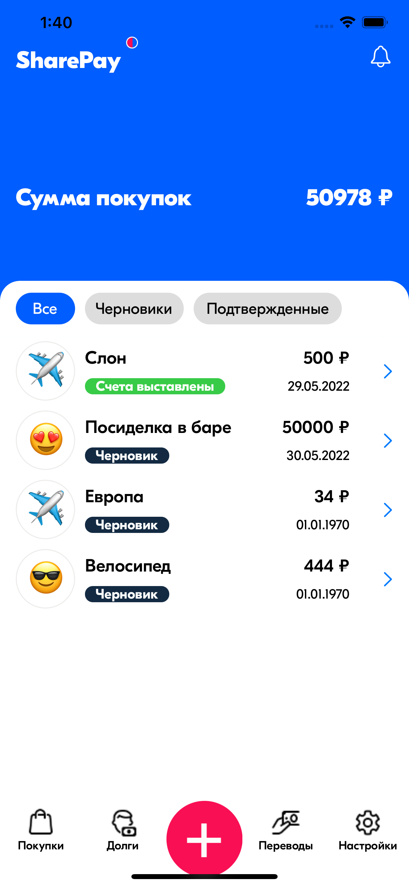
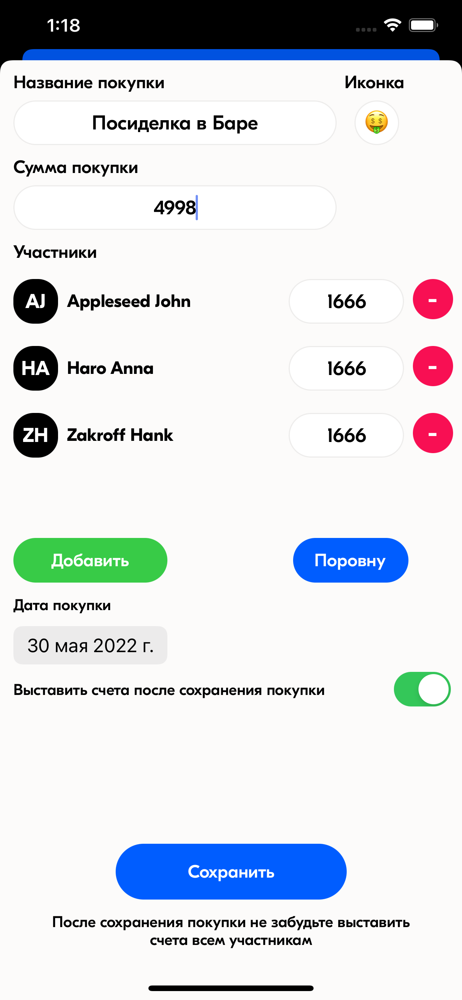
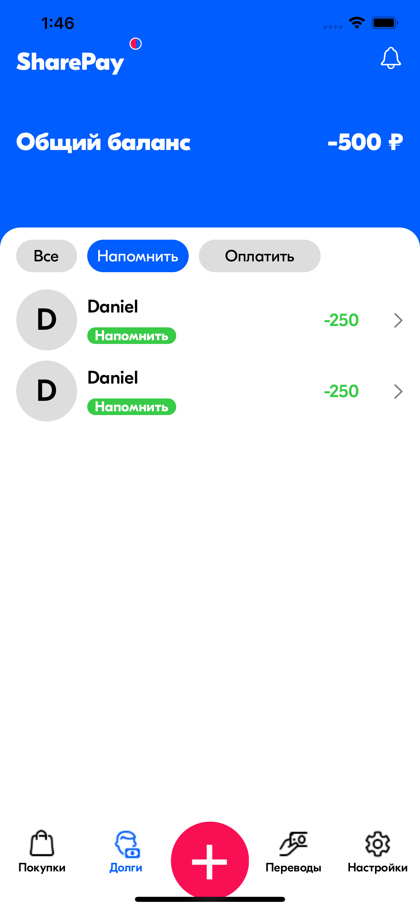
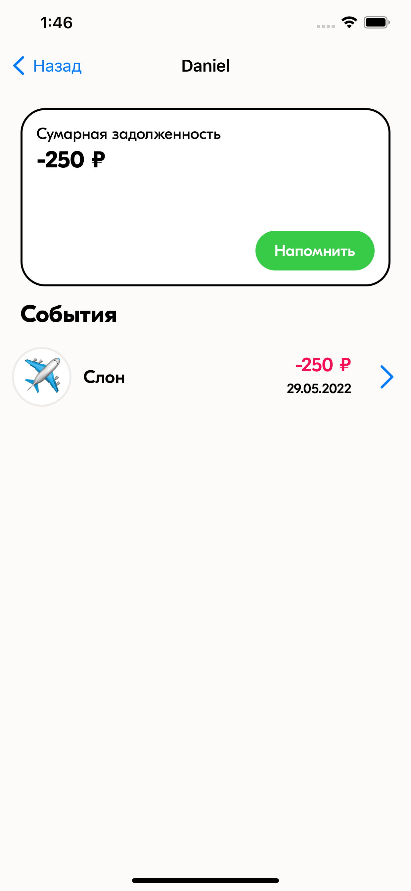
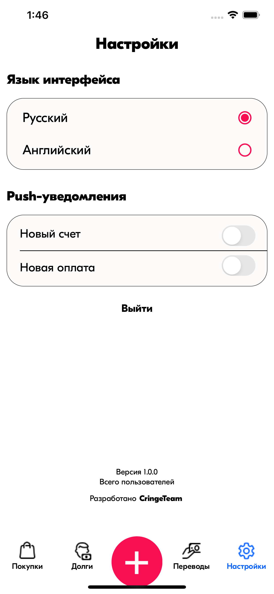
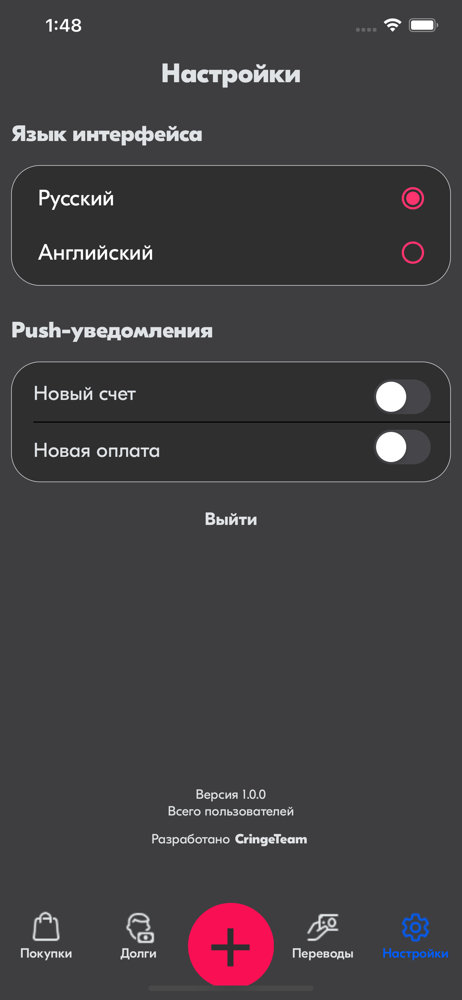

<h1 align="center">SharePay</h1>

🧪 **alpha-версия 0.1**: SMS-код **1234**

## Описание проекта

### Какие проблемы решает?

**SharePay** - это проект, который помогает следить за расходами и поддерживает актуальное состояние долгов при совместных покупках. Цель приложения уменьшить настоящее количество денежных переводов друг другу. Проводя учет долгов в приложении, пользователи оплачивает их целиком и только при необходимости или напоминании со стороны другого пользователя.

### Аналоги и их недостатки

- **SpendTogether** - не работает в многопользовательском режиме.  
- **Счетопил** - стремный дизайн
- **Split** - отсутствие учета транзакций и долгов
- **Долги** - нет функции учета совместных покупок
- **Split it** - очень странный многопользовательский режим, через IMessage
- **Steven** - невозможность выставить счет не зарегистрированному клиенту
- **Распил** - отсутствует возможность неравномерного разделения счетов между пользователями

### Ключевые преимущества **SharePay**

- Удобство регистрации по мобильному телефону
- Многопользовательский режим
- Постоянный пересчет взаимных задолженностей
- Удобный интерфейс для учета совместных покупок
- Реализована локализация и темная тема в приложении

## Возможности для пользователя

### Учет покупок и разделение оплаты

Сумма оплаты за покупку может быть разделена между людьми из списка контактов. После подтверждения покупки пользователем, приложение автоматически выставит счета, пересчитает сумму долга между всеми пользователями и направит уведомления о новом счете.

### Учет баланса и суммы задолженности

Приложение учитывает взаиморасчеты между двумя пользователями и в качестве долга выводит итоговую сумму по всем неоплаченным счетам, которые можно оплатить единоразово. Также приложение помогает отслеживать текущий баланс, который складывается из суммы задолженностей перед пользователем.

### Напоминание о погашении

В предлагаемом сценарии оплата за выставленный счет происходит не сразу. Со временем счета копятся и учитываются в сумме задолженности между двумя пользователями. Отправляя напоминания об оплате, пользователь просит полностью оплатить текущую сумму долга. 

### Будущие фичи

- Список покупок (парсинг чека по QR)
- Умные пуши с действиями
- Виджет с информацией
- Статистика и графики
- Реализация поиска счетов/покупок

## Наша команда - **CringeTeam**

## Демо

### Покупки

### Долги

### Настройки

